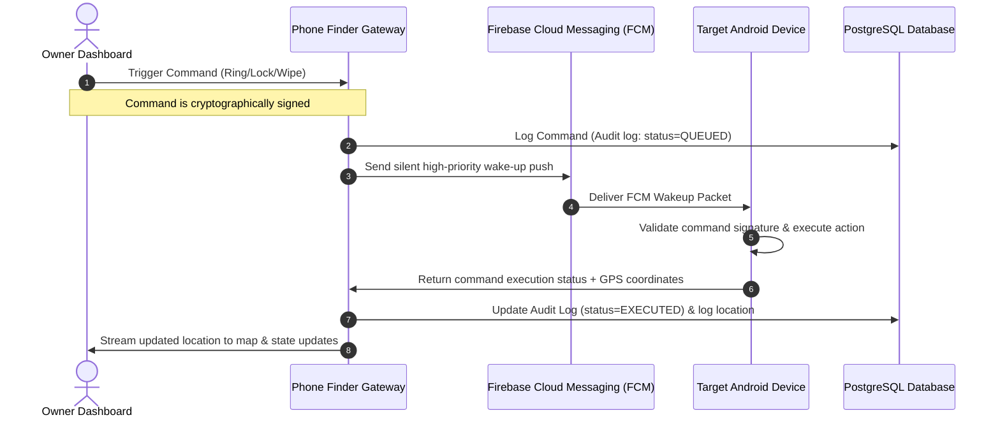
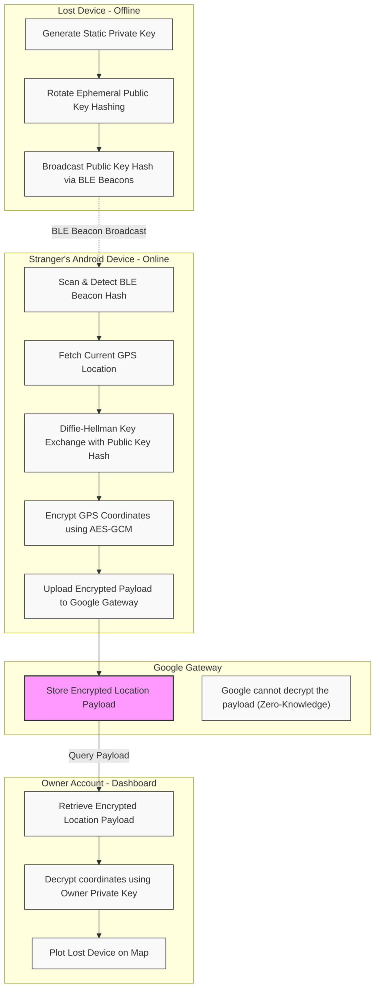

# Project Technical Overview & Architecture

This document provides a comprehensive technical overview, flow diagrams, and architectural analysis of the **Google Phone Finder Simulator & Educational Showcase**.

---

## 1. Project Description

The **Google Phone Finder Simulator & Educational Showcase** is an interactive, premium educational web application that models the system architecture, database design, and cryptographic privacy protocols behind modern device-tracking ecosystems (specifically referencing Google's Find My Device mesh).

The project serves as an interactive playground demonstrating:
* **Real-time Geolocation Mapping**: Demonstrates spatial telemetry tracking, accuracy radii, and live map updates.
* **Device Control Telemetry**: Interactive simulators for remote actions (ringing alarms, locking devices, and factory-reset partitions).
* **UWB Radar Simulator**: Illustrates signal strength (RSSI) translation to distance estimates.
* **Zero-Knowledge Privacy Mesh**: Demonstrates how offline/low-battery devices can be located securely using crowd-sourced BLE networks without exposing private location data to intermediary gateways.

---

## 2. Online Command Flow (Ring / Lock / Erase)

This sequence diagram details the process when an owner triggers an online command (such as playing an audio alarm, locking the screen, or wiping data) from their web dashboard.

---

## 3. Offline BLE Mesh Network Finder Flow

This flowchart illustrates the cryptographic privacy protocol used to locate offline devices via a crowd-sourced network of surrounding stranger devices (zero-knowledge location tracking).

---

## 4. Key Architectural Pillars

1. **Authentication & Identity**: Simulated OAuth 2.0 and Time-Based One-Time Password (TOTP) verification on secondary endpoints.
2. **Low-Latency Push Pipeline**: Utilizes Firebase Cloud Messaging (FCM) channels to bypass sleep state optimizations on client operating systems.
3. **Database Ledger**:
   * **PostGIS Extensions**: Used to support radial spatial coordinates and quick proximity indexing.
   * **Relational Schemas**: Explicit tracking of device health (battery, locks, data states) and cryptographic signature logs.
4. **End-to-End Encryption (E2EE)**: Secures geolocation packets using Ephemeral Elliptic Curve Diffie-Hellman (ECDH) key exchanges on local radios, keeping locations secure from third-party relays.
